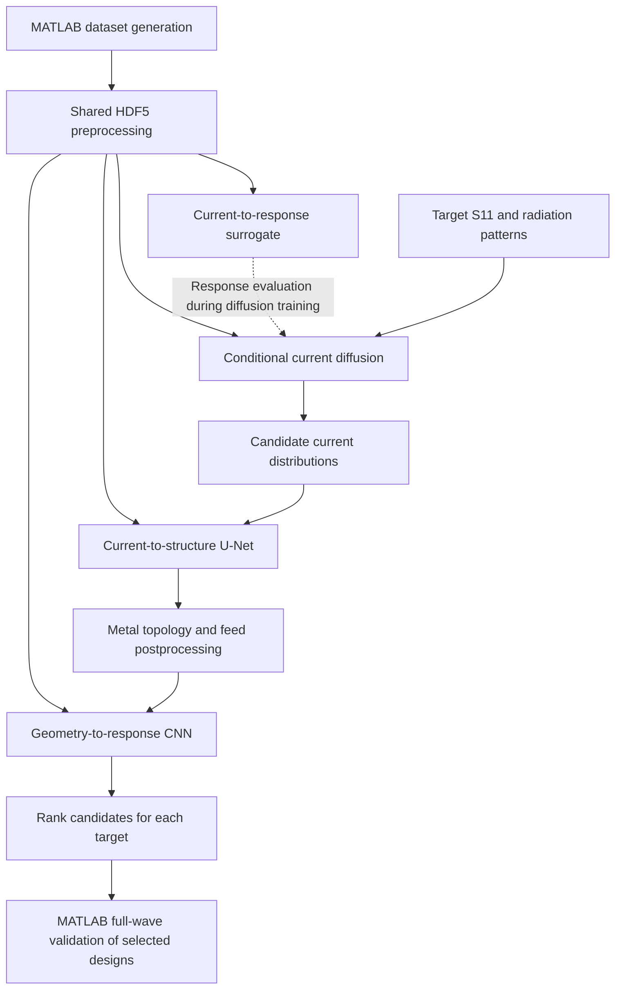

# AI4Ant: Deep Learning for Antenna Forward Prediction and Inverse Design

AI4Ant is a research codebase for pixelated patch antenna design. It combines MATLAB electromagnetic simulation with PyTorch models for response prediction, conditional current generation, and reconstruction of antenna topology and feed position.

The repository covers dataset generation, shared preprocessing, model training and evaluation, and inverse design with full-wave validation. Its AntGen pipeline generates multiple candidates for each target response, ranks them with a geometry-based surrogate, and validates the selected designs in MATLAB.

## Workflow



The two forward models serve different roles: the **current forward surrogate** evaluates generated currents during diffusion training and testing; the **geometry-based CNN** ranks reconstructed antenna structures in AntGen.

## Repository layout

| Directory | Purpose |
| --- | --- |
| [`data_generation/`](data_generation/) | MATLAB dataset generators and dataset quality analysis. |
| [`datasets/`](datasets/) | Shared HDF5 readers, layout conversion, standardization, data splits, and task loaders. |
| [`CNN-based forward surrogate model/`](CNN-based%20forward%20surrogate%20model/) | Metal topology and feed map to S11 and radiation patterns. |
| [`Current forward surrogate/`](Current%20forward%20surrogate/) | Surface current distributions to S11 and radiation patterns. |
| [`Current diffusion model/`](Current%20diffusion%20model/) | Conditional DDPM that generates currents from target S11 and radiation patterns. |
| [`Current to structure UNet/`](Current%20to%20structure%20UNet/) | Current distributions to metal topology and feed position. |
| [`AntGen/`](AntGen/) | Candidate generation, topology postprocessing, surrogate ranking, and MATLAB validation. |
| [`Single_ant/`](Single_ant/) | Individual antenna examples, current analysis, and optimization experiments. |
| [`pct_benchmark/`](pct_benchmark/) | Parallel simulation and optimization benchmarks. |

## Environment

### Python

Use Python 3.10 or later with PyTorch, NumPy, h5py, SciPy, Matplotlib, tqdm, and pandas. The following installs the shared dependencies from the repository root:

```powershell
python -m venv .venv
.\.venv\Scripts\Activate.ps1
python -m pip install torch numpy h5py scipy matplotlib tqdm pandas
```

For GPU execution, use a PyTorch build compatible with your CUDA environment. Device selection supports `auto`, `cpu`, and `cuda`; adjust batch sizes and data-loader worker counts to suit your hardware.

### MATLAB

MATLAB is required for dataset generation and full-wave validation. Toolbox requirements depend on the script:

- **Antenna Toolbox** for antenna modeling and electromagnetic simulation.
- **Parallel Computing Toolbox** for parallel generation, benchmarks, and parallel AntGen validation.
- **Optimization Toolbox** is explicitly checked by `Ant_data_gen_v1p0.m`.
- **Image Processing Toolbox** for the morphology and connected-component operations used by dataset generators.

AntGen launches MATLAB through the `matlab` executable; its command and worker count are configurable in [`AntGen/config.py`](AntGen/config.py).

## Data preparation

### Generate or provide a dataset

Raw HDF5 datasets and trained model checkpoints are not included in the tracked repository. Generate a dataset or supply a compatible one before training. The tracked `.standardizer.pt` files contain preprocessing statistics, not trained networks.

[`data_generation/Ant_data_gen_v1p0.m`](data_generation/Ant_data_gen_v1p0.m) provides the 16 x 16 topology, 32 x 32 current-grid configuration used by the current model defaults. Review its sample counts, geometry, frequency settings, and `num_workers_to_use` before running; the defaults describe a large generation job.

From the repository root:

```powershell
matlab -batch "addpath('data_generation'); Ant_data_gen_v1p0"
```

The generator writes timestamped HDF5 files to `dataset_out/` under the working directory. Other generator versions use different settings, so check their dimensions and response definitions before reusing existing checkpoints.

### Preprocess once for all models

Pass the raw dataset path to the shared preprocessing entry point. In these examples, replace `your_dataset` with the actual filename:

```powershell
python datasets/preprocess.py "dataset_out/your_dataset.h5"
```

This produces files alongside the source dataset:

```text
your_dataset.h5
your_dataset.preprocessed.h5
your_dataset.preprocessed.standardized.h5
your_dataset.standardizer.pt
```

Preprocessing restores the Python training layout and physical spatial axes, converts the feed location to a Gaussian map, and computes normalization statistics using only the training split. The default split is 80% training, 10% validation, and 10% testing, with seed `106`.

The default data layout is:

| Key | Preprocessed shape | Meaning |
| --- | --- | --- |
| `X` | `(N, 2, 16, 16)` | Metal mask and Gaussian feed map. |
| `current` | `(N, 5, 4, 32, 32)` | Five frequencies, each with `Re(Jx)`, `Im(Jx)`, `Re(Jy)`, and `Im(Jy)`. |
| `Y` | `(N, 41)` | Linear S11 magnitude over 8-12 GHz. |
| `pattern` | `(N, 5, 4, 120)` | Radiation patterns at five frequencies, four plane/polarization channels, and 120 angles. |

Current tensors retain separate frequency and component axes in HDF5; model loaders flatten these to `(N, 20, 32, 32)`. The AntGen response convention uses linear gain with channel order `XOZ_Gtheta`, `XOZ_Gphi`, `YOZ_Gtheta`, `YOZ_Gphi`.

Structure channels are mapped from `[0, 1]` to `[-1, 1]`. Currents use a signed-log transform, clipping, and per-frequency/component standardization. S11 uses shared scalar statistics; patterns use per-frequency/component statistics. See [`datasets/README.md`](datasets/README.md) for the detailed transformations.

All models should use the same standardized dataset and consistent split settings. The default configurations reference `datasets/antenna_dataset_20260614_203654.preprocessed.standardized.h5`; override that path for your own data. Use preprocessing's `--force` option when explicitly rebuilding caches.

## Model training and evaluation

Run the following commands from the repository root. Each model has a `configs/default_config.py` file, and its entry points expose command-line overrides through `--help`.

First, train the geometry surrogate, current surrogate, and current-to-structure model on the shared dataset:

```powershell
python "CNN-based forward surrogate model/train.py" --h5_path "dataset_out/your_dataset.preprocessed.standardized.h5"
python "Current forward surrogate/train.py" --h5_path "dataset_out/your_dataset.preprocessed.standardized.h5"
python "Current to structure UNet/train.py" --h5_path "dataset_out/your_dataset.preprocessed.standardized.h5"
```

Then train the conditional diffusion model with the trained **current forward surrogate** checkpoint. Replace `<current_run>` with the actual run directory name:

```powershell
python "Current diffusion model/train.py" --h5_path "dataset_out/your_dataset.preprocessed.standardized.h5" --surrogate_checkpoint "Current forward surrogate/outputs/train/<current_run>/checkpoints/best_model.pt"
```

The diffusion configuration contains an experiment-specific surrogate checkpoint path, so set it explicitly for a new training run. The current surrogate is frozen and used to evaluate the responses of sampled currents.

Training outputs include checkpoints, logs, and metric plots. Default checkpoint locations are:

| Model | Best checkpoint |
| --- | --- |
| Geometry CNN, current surrogate, diffusion | `<project>/outputs/train/train_YYYYMMDD_HHMMSS/checkpoints/best_model.pt` |
| Current-to-structure U-Net | `Current to structure UNet/outputs/train_YYYYMMDD_HHMMSS/checkpoints/best_model.pt` |

Each project provides `test.py`; the two surrogates and the structure U-Net also provide `infer.py`. For example, evaluate the geometry surrogate with:

```powershell
python "CNN-based forward surrogate model/test.py" --h5_path "dataset_out/your_dataset.preprocessed.standardized.h5" --checkpoint "CNN-based forward surrogate model/outputs/train/<cnn_run>/checkpoints/best_model.pt"
```

Replace all run placeholders with existing directories. Checkpoint normalization statistics and dataset conventions must match the data used for evaluation and downstream generation.

## AntGen inverse design

AntGen currently takes target S11 and radiation patterns from the dataset's **test split**. For `m` conditions and `n` candidates per condition, it:

1. Samples `m * n` current distributions with the conditional diffusion model.
2. Predicts metal and feed logits with the current-to-structure U-Net.
3. Thresholds the metal map, selects the global feed maximum, forces that pixel to metal, and by default keeps only the four-connected metal component containing the feed.
4. Evaluates all candidates with the geometry CNN and ranks each condition's candidates by weighted S11/pattern MAE.
5. Sends the single highest-ranked candidate per condition to MATLAB, for `m` full-wave simulations.
6. Reports surrogate scores and full-wave validation errors separately.

The default ranking gives equal weight to S11 MAE and pattern MAE. Surrogate ranking does not guarantee the best full-wave result among all candidates.

Configure dataset and checkpoint paths, sampling, postprocessing, ranking weights, and MATLAB settings in [`AntGen/config.py`](AntGen/config.py). AntGen needs three trained checkpoints: diffusion, current-to-structure U-Net, and geometry CNN. When those paths are `None`, it discovers the most recently modified `best_model.pt` in each project's training outputs; set explicit paths to reproduce a particular experiment.

Run a complete pipeline with the configured defaults:

```powershell
python AntGen/run.py
```

For a smaller run, override the sample counts:

```powershell
python AntGen/run.py --num-conditions 4 --num-candidates 8 --matlab-workers 1
```

`--matlab-workers 1` runs validation serially; `0` uses MATLAB's default parallel pool, and values greater than `1` request that number of workers.

Stages can also be run separately:

```powershell
python AntGen/run.py --stage infer --num-conditions 4 --num-candidates 8
python AntGen/run.py --stage simulate --run-dir "AntGen/outputs/run_YYYYMMDD_HHMMSS" --matlab-workers 1
python AntGen/run.py --stage analyze --run-dir "AntGen/outputs/run_YYYYMMDD_HHMMSS"
```

Use the run directory printed by `infer` for the later stages. `infer` generates and ranks candidates without launching MATLAB; `simulate` runs full-wave validation and analysis; `analyze` recomputes reports from existing simulation results.

Each run is organized under `AntGen/outputs/run_YYYYMMDD_HHMMSS/`:

| Subdirectory | Main contents |
| --- | --- |
| `artifacts/` | Run manifest, configuration, checkpoint references, and generated candidates. |
| `surrogate/` | CNN predictions, candidate rankings, selected-candidate records, and surrogate summary. |
| `fullwave/` | Selected structures, MATLAB input/output files, simulation results, and full-wave summary. |
| `reports/` | Combined run summary. |
| `figures/` | Candidate topologies, generated currents, response comparisons, and metric plots. |

See [`AntGen/README.md`](AntGen/README.md) for detailed postprocessing, coordinate conventions, metrics, and output filenames.

## MATLAB examples and checks

Run an individual antenna example or parallel benchmark from the repository root:

```powershell
matlab -batch "addpath('Single_ant'); single_pixel_antenna"
matlab -batch "addpath('pct_benchmark'); pct_benchmark_pixel_antenna"
```

Meshing, full-wave solving, and dataset generation can require substantial CPU time and memory. Set worker counts and experiment sizes in the corresponding scripts before large runs.

Run the AntGen unit tests with:

```powershell
python -m unittest discover -s AntGen/tests -v
```

## License

This project is released under the [MIT License](LICENSE).
